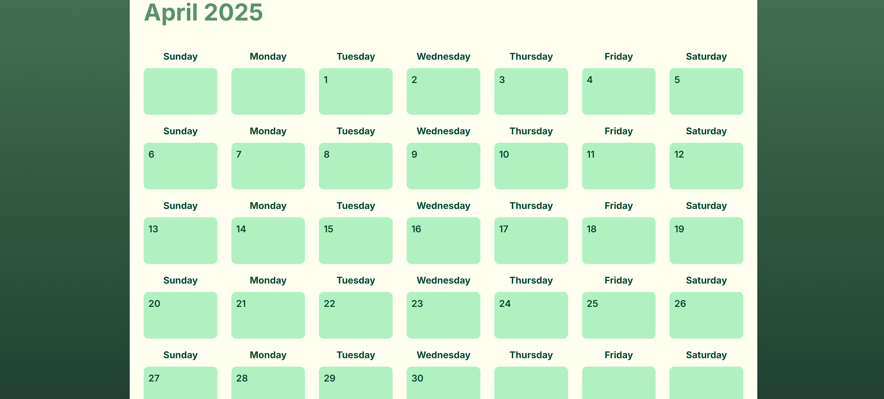
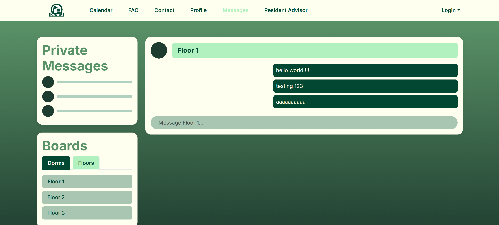
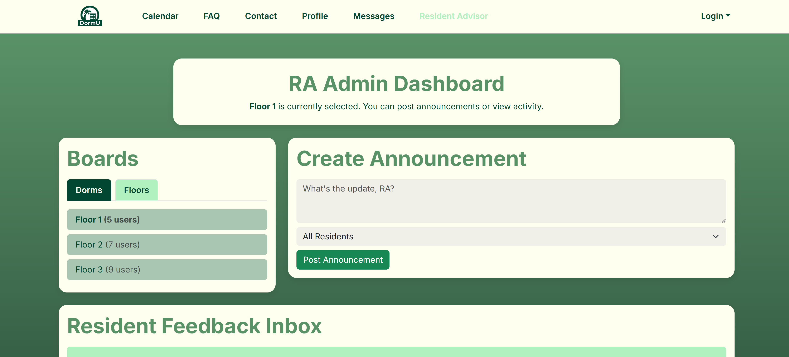

# 

* [Overview](/index)
* [User Guide](/user-guide.md)
* [Developer Guide](/developer-guide.md)
* [Development History](/dev-history.md)
* [Community Feedback](/community-feedback.md) 
* [Contact us](/contact-us.md)  

## Skip to
- [Milestone 1](#milestone-1)
- [Milestone 2](#milestone-2)
- [Milestone 3](#milestone-3)

# Milestone 1
## Links to M1 Requirements
### [M1 Issues](https://github.com/orgs/dorm-u/projects/1/views/1)

### [Click here to see the live website!](https://dorm-u-app.vercel.app/)

## Changelog
* Created mockup sketches for project (see below)
* Created project homepage and M1 page (This page)
* Got system running on Vercel
* Implemented landing page into application

## Mockup Sketches
What new users will experience before logging in

What users will see after logging in

What users profile page would look like

Concept Art for different features (Events, Messages, Explore)

# Milestone 2

## Links for M2

### [Live Website]()
### [Github Project Repo](https://github.com/dorm-u/dorm-u-app/tree/profile-page)
### [M2 Issues](https://github.com/orgs/dorm-u/projects/4/views/2)

## Changelog
* Implemented Calendar, Profile, Messages, and RA page 
* **Added PostegreSQL write to the profile page (Read not working yet)**
* Updated prisma schematic for user roles
* Overhauled project homepage and added user guide and developer guide
* Implemented contiguous integration on Github

## Live site screenshots
The landing page, before logging in

An events/calendar page where announcements & upcoming activities are posted

A sample profile format on DormU

Where users can chat between eachother, floors, dorms, etc

What the RAs (Admins) will see on their dashboard

# Milestone 3
## Links for M3
### [Live Website](https://dorm-u-app.vercel.app/)
### [Github Project Repo](https://github.com/dorm-u/dorm-u-app/tree/profile-page)
### [M3 Issues](https://github.com/orgs/dorm-u/projects/5/views/1)

## Changelog
* Implemented Functionality for events and profile page
* Implemented Roles and Resident Assistant privilages
* Implemented Messages
* Added a FAQ page
* Contact Page to Contact RA
* Added user reviews to Project homepage
* Updated user guide and developer history

## Live site screenshots

