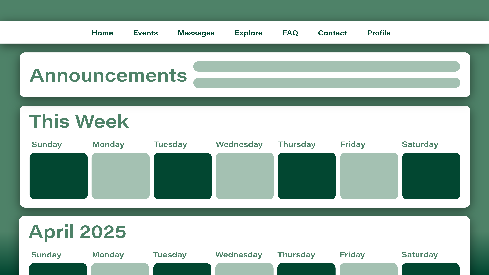

# DormU 
DormU is an application that allows University of Hawaii at Manoa dormitary residents within the same floor to connect and communicate with their Resident Assistant (RA) as well as other members of the community. Residents can chat and share media with each other to show what they have been up to. RA's can remind their residents of important updates or announcement within their community. 

# Table of Contents
- The Why?
- Project Planning and Proposal
- Milestone 1

# The Why?
Purpopse: 
Being a resident advisor (RA) in the on-campus dormitories, a common obstacle we face is building community and finding ways to build communication and connections throughout the floor. Although there have been steps to take a digital approach, most are too complex or lack features that would make it worth resident’s use.

Solution:
DormU is an application that allows UH housing residents within the same floor to connect and communicate with their RA as well as other members of the community.

# Project Planning and Proposal

## Team Contract
[Team Contract](https://docs.google.com/document/d/1Qm1v_5a2nuVIiFUtSyt9DgEoI1dggFdNf_GunExgGYE/edit?usp=sharing)

## Project Proposal
[Team Presentation](https://docs.google.com/presentation/d/1vgJbArzciW5jrLGX2hNoa8ToWXGg1KQTVep5UJC3eXg/edit?usp=sharing)

## Deployment
DormU uses the following resources:
- Bootstrap for CSS Framework for UI design.
- React for Javascript-Style UI Components
- NextJS for better framework design
- Prisma for model handling
- Postgres for database storing
- Vercel for live server hosting

## (Planned) Features
- Chatting capablities with privacy limitations
- Gallery to see media from community
- Calendar to see all housing sponsered events
- Ability to create study/interest groups
- "Awards" on profile page for completing events
- Mealshare program for residents that don't have meals for the week

# Milestone 1

## Vercel Link
[Click here to see the live website!]()

## Mockup Sketches
What new users will experience before logging in

What users will see after logging in

What users profile page would look like

Concept Art for different features (Events, Messages, Explore)

