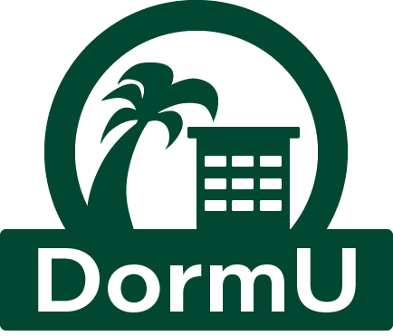
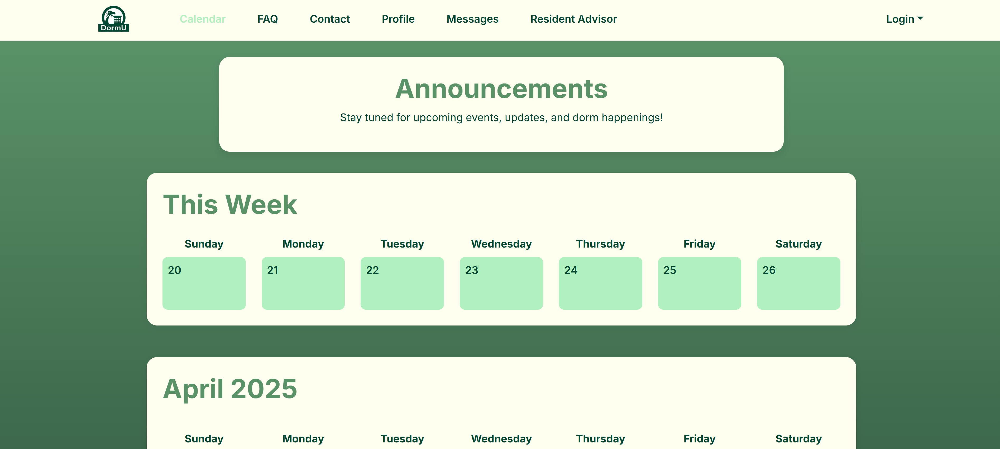
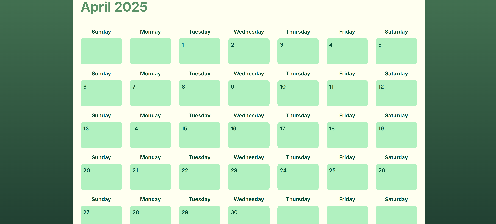
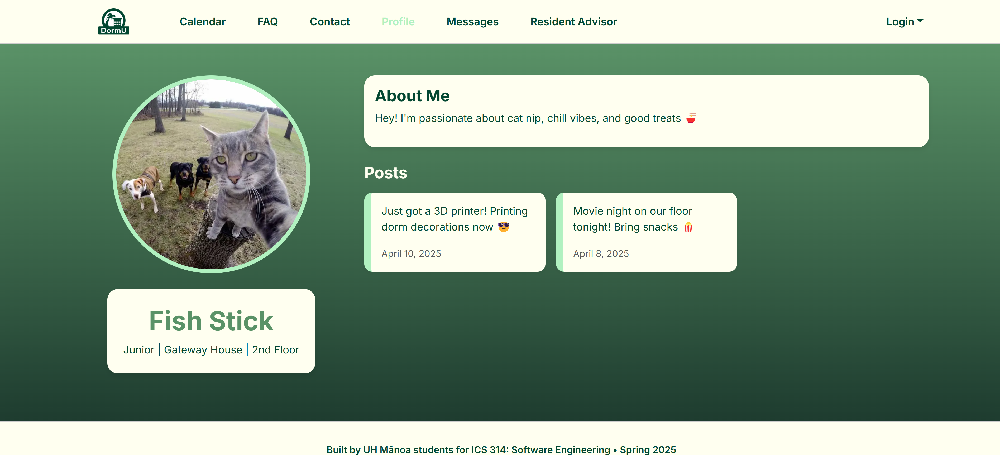
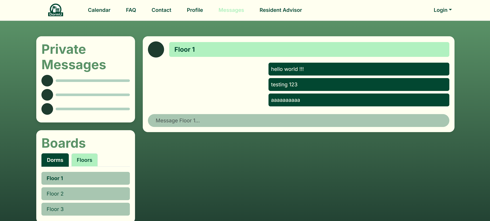
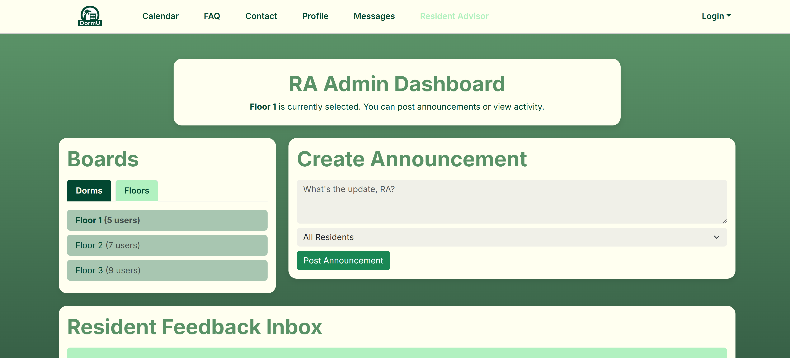
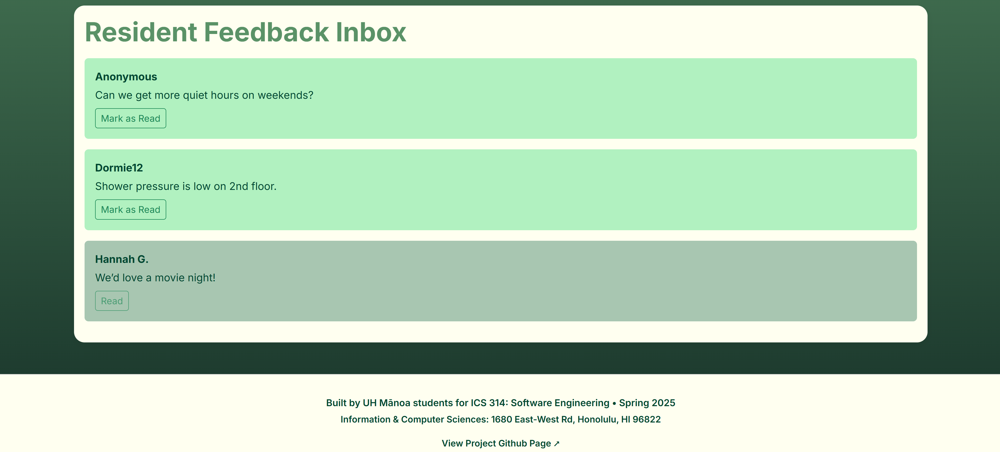

# 

* [Overview](/index)
* [User Guide](/user-guide.md)
* [Developer Guide](/developer-guide.md)
* [Development History](/dev-history.md)
* [Community Feedback](/community-feedback.md) 
* [Contact us](/contact-us.md)  

# User Guide
Here you can read about the various features you can currently do in the DormU application.

## Landing Page

The landing page features a description of the main capabilities of the system. Non-logged in users are able to see the calendar, FAQ, and Contact pages.

### Logging in

Users are able to log in using their email address and a password of thier choice. They are also able to sign up for an account if they do not already have one. 

### User Roles

Users with specific email addresses will automatically be given the RA role and have administrative privilages. 

## Calendar Page

Users will be able to see upcoming events on the calendar. There are two views, one for the current week and one for the current month. Currently, nothing can be added to the calendar but future announcements from RAs will soon be implemented.

## Profile Page

The profile page allows users to customize information about themselves. 

All logged in users have a unique profile page, which they can customise to their own flavor. Their floor and building is automatically put for them, and they can edit their profile image, about me, class standing, and current classes.

Users can also see a history of their previous posts.

## Messages Page

The messages page includes messaging in different chat rooms based on floor and room assignment. 

There is also a section for private messaging, which also allows for creating group messages as well. 

## RA Page

The RA Page is only accessable to those who have the RA role. Users are able to create announcements that will be broadcast to all residents specified. 

They are also able to see feedback from residents and any concerns that they may have, 
